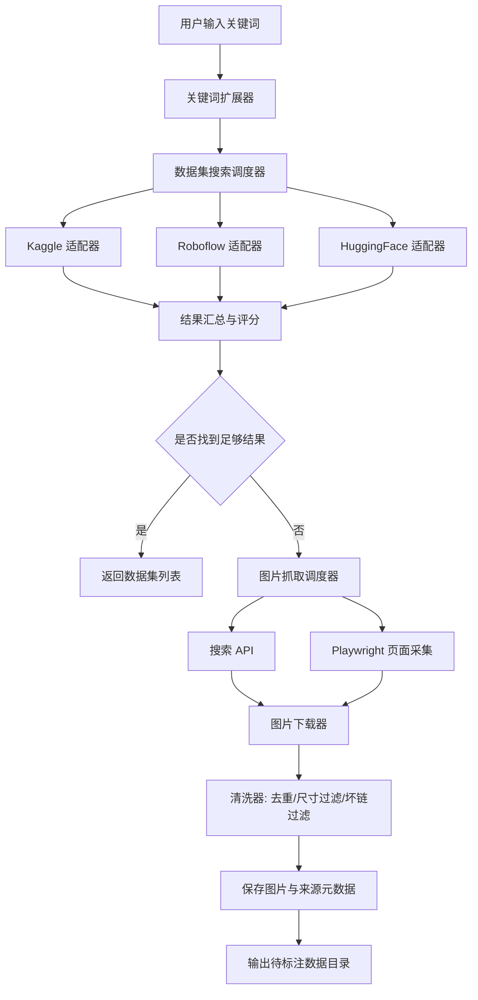

# YOLO 训练数据获取工具 MVP 方案

## 1. 目标

输入一个目标字段，例如：

- `helmet`
- `safety helmet`
- `工地安全帽`

工具自动完成以下流程：

1. 先搜索互联网上是否已有可直接使用的公开数据集。
2. 如果找到合适数据集，返回数据集名称、网址、许可证、预估规模。
3. 如果没有找到足够合适的数据集，自动抓取一定数量的相关图片。
4. 对抓取结果做基础清洗：去重、尺寸过滤、坏链过滤、来源记录。
5. 输出一个适合后续人工筛选和标注的图片目录。

这个 MVP 的目标不是“一步到位产出可训练的高质量 YOLO 数据集”，而是先快速搭一个“数据发现 + 数据补采集”的最小可用链路。

---

## 2. MVP 核心思路

推荐采用“多源检索优先，图片抓取兜底”的两阶段方案：

- 第一阶段：优先检索公开数据集平台。
- 第二阶段：如果结果不足，再走图片搜索与网页采集。

这样做比纯爬虫更稳，原因有三个：

1. 已有公开数据集质量通常高于直接抓图。
2. 公开数据集往往已经包含标注或至少具备明确许可证。
3. 抓图阶段噪声很大，必须作为兜底，而不是主路径。

---

## 3. 推荐数据源

### 3.1 数据集检索源

优先接这些源：

- `Kaggle`
- `Roboflow Universe`
- `Hugging Face Datasets`
- `Google Dataset Search`
- `Open Images`

MVP 阶段建议先做 2 到 3 个适配器即可，优先级建议如下：

1. `Kaggle`
2. `Roboflow Universe`
3. `Hugging Face Datasets`

原因：

- 社区数据集多，命中率高。
- 页面结构和搜索入口相对清晰。
- 后续可扩展性比较好。

### 3.2 图片采集源

优先使用以下方式：

- 搜索 API：`SerpAPI`、`Bing Image Search API`
- 浏览器自动化：`Playwright`
- 辅助下载：`icrawler`

MVP 不建议一开始直接手写复杂网页解析器，优先考虑：

1. 用搜索 API 拿图片结果页数据。
2. 再用 `requests/httpx` 下载图片。
3. 只有 API 不满足时，才用 `Playwright` 做页面模拟。

---

## 4. 整体架构图



---

## 5. 目录设计

```text
YOLOidentification/
├─ app/
│  ├─ __init__.py
│  ├─ main.py                    # 程序入口
│  ├─ config.py                  # 配置项
│  ├─ models/
│  │  ├─ __init__.py
│  │  ├─ query.py                # 输入查询模型
│  │  ├─ dataset_result.py       # 数据集检索结果模型
│  │  └─ image_result.py         # 图片结果模型
│  ├─ services/
│  │  ├─ __init__.py
│  │  ├─ keyword_service.py      # 关键词扩展
│  │  ├─ dataset_search_service.py
│  │  ├─ image_search_service.py
│  │  ├─ image_download_service.py
│  │  ├─ cleaning_service.py     # 去重与过滤
│  │  └─ pipeline_service.py     # 主流程编排
│  ├─ adapters/
│  │  ├─ __init__.py
│  │  ├─ dataset/
│  │  │  ├─ __init__.py
│  │  │  ├─ base.py
│  │  │  ├─ kaggle_adapter.py
│  │  │  ├─ roboflow_adapter.py
│  │  │  └─ huggingface_adapter.py
│  │  └─ image/
│  │     ├─ __init__.py
│  │     ├─ base.py
│  │     ├─ serpapi_adapter.py
│  │     └─ playwright_adapter.py
│  ├─ utils/
│  │  ├─ __init__.py
│  │  ├─ http.py
│  │  ├─ file_utils.py
│  │  ├─ hash_utils.py
│  │  └─ logger.py
│  └─ storage/
│     ├─ __init__.py
│     └─ manifest_store.py       # 保存来源与抓取记录
├─ data/
│  ├─ raw/
│  │  └─ helmet/
│  ├─ cleaned/
│  │  └─ helmet/
│  └─ manifests/
│     └─ helmet.json
├─ scripts/
│  └─ run_mvp.py
├─ requirements.txt
└─ README.md
```

### 目录职责说明

- `models/`：只放数据结构，不写复杂业务。
- `adapters/`：屏蔽不同平台的接入差异。
- `services/`：编排业务流程，是 MVP 的核心。
- `storage/`：负责保存抓取记录、来源 URL、许可证等元信息。
- `data/`：保存原始图片、清洗后图片、manifest。

这种结构的好处是后续扩展新平台时，只需要新增适配器，不用改主流程。

---

## 6. MVP 执行流程

### 6.1 输入

用户输入：

- 主关键词，例如 `helmet`
- 同义词列表，例如 `hard hat`, `safety helmet`
- 目标图片数量，例如 `300`
- 最小分辨率，例如 `640x640`
- 是否允许补爬，例如 `true`

### 6.2 流程

1. 关键词扩展。
2. 调用多个数据集搜索适配器。
3. 合并搜索结果并按相关度排序。
4. 若命中结果达到阈值，则直接返回数据集链接列表。
5. 若命中结果不足，则调用图片搜索适配器获取候选图片 URL。
6. 下载图片到 `data/raw/<keyword>/`。
7. 执行去重、尺寸过滤、坏图过滤。
8. 将可用图片输出到 `data/cleaned/<keyword>/`。
9. 生成 manifest 文件，记录来源和后续标注依据。

---

## 7. 关键设计点

### 7.1 结果判定策略

不要简单以“搜到了就算成功”，建议做一个最低质量判定：

- 标题是否包含关键词或同义词
- 描述是否相关
- 是否可访问
- 是否有明确许可证
- 预估图片数量是否足够

可以先用简单打分：

- 标题命中：`+5`
- 描述命中：`+3`
- 有许可证：`+2`
- 结果页可访问：`+1`
- 数据量达到阈值：`+3`

当最高分结果低于某个阈值，例如 `6` 分，就进入抓图流程。

### 7.2 图片采集策略

抓图阶段只做“采集候选图”，不直接假设它们能用于训练：

- 优先下载原图或较大图。
- 必须记录来源页面 URL。
- 按域名限频，避免触发封禁。
- 保留失败日志，便于重试。

### 7.3 清洗策略

MVP 至少做这几项：

- 图片格式过滤：只保留 `jpg/jpeg/png/webp`
- 图片尺寸过滤：最小边低于阈值则剔除
- 感知哈希去重：去掉近似重复图
- 下载失败剔除
- 空文件或损坏文件剔除

### 7.4 YOLO 场景特别说明

这个工具只解决“找图”和“补图”，不直接解决标注质量问题。  
用于 YOLO 训练时，后续建议补一层流程：

- 人工筛图
- 自动预标注
- 人工校正标注
- 再导出为 YOLO 格式

否则直接拿抓图结果训练，噪声会非常高。

---

## 8. 模块职责简表

如果不需要代码骨架，MVP 只保留下面这些模块职责即可：

- `models`
  - 定义输入参数、数据集结果、图片结果等基础数据结构。
- `adapters/dataset`
  - 对接 `Kaggle`、`Roboflow Universe`、`Hugging Face Datasets` 等数据集来源。
- `adapters/image`
  - 对接图片搜索 API 或浏览器自动化采集来源。
- `services/keyword_service`
  - 负责关键词扩展、同义词合并、去重。
- `services/dataset_search_service`
  - 统一调度多个数据集搜索源，并对结果做打分排序。
- `services/image_search_service`
  - 当公开数据集不足时，负责搜索候选图片链接。
- `services/image_download_service`
  - 负责下载图片、失败重试、基础命名。
- `services/cleaning_service`
  - 负责尺寸过滤、格式过滤、坏图剔除、感知哈希去重。
- `storage/manifest_store`
  - 负责保存抓取来源、下载结果、过滤统计和许可证信息。
- `services/pipeline_service`
  - 串联整个流程，决定“直接返回数据集”还是“进入补爬模式”。

---

## 9. MVP 依赖建议

`requirements.txt` 可先包含：

```txt
httpx
beautifulsoup4
playwright
pillow
imagehash
pydantic
```

如果后续接搜索 API，还可以增加：

```txt
serpapi
```

---

## 10. 后续迭代建议

MVP 跑通后，下一步建议按这个顺序扩展：

1. 补真实的 `Kaggle / Roboflow / Hugging Face` 搜索适配器。
2. 接入一个稳定的图片搜索源，例如 `SerpAPI`。
3. 增加并发下载与失败重试。
4. 增加来源域名限频和黑名单过滤。
5. 增加 CLIP 相似度过滤，减少明显无关图片。
6. 增加导出到标注工具的数据目录，例如 `Label Studio` 或 `CVAT`。

---

## 11. 最小可行落地建议

如果你现在要尽快开工，建议第一版只做下面这些：

- 只支持一个关键词输入
- 只接 `KaggleAdapter`
- 只接一个图片搜索适配器
- 只做串行下载
- 只做尺寸过滤 + 感知哈希去重
- 输出 `manifest.json`

这版已经足够验证核心闭环：

`关键词输入 -> 搜公开数据集 -> 不足则补爬 -> 清洗 -> 输出待标注目录`

---

## 12. 风险与注意事项

- 不同网站的使用条款不同，不能默认任意抓取。
- 搜索引擎结果页结构经常变化，纯 HTML 解析不稳定。
- 训练数据最难的不是“抓到图”，而是“图是否真的适合标注和训练”。
- 对 YOLO 来说，类别边界、场景多样性、遮挡、角度、负样本同样重要。

所以这个工具的定位应该是：

**训练数据发现与补采集工具**，不是“全自动高质量数据集生成器”。
